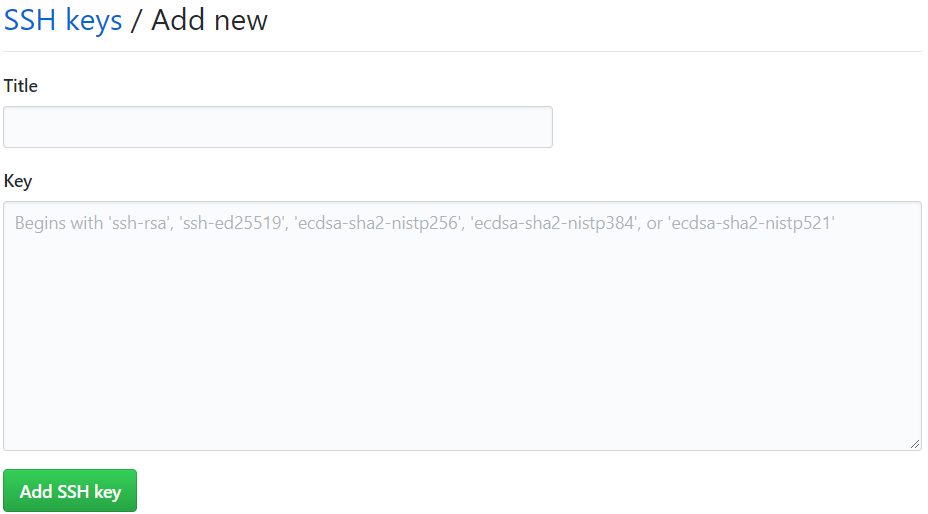
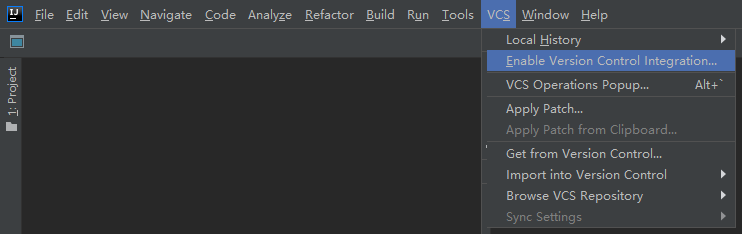
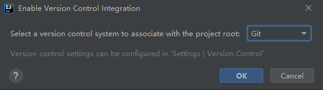
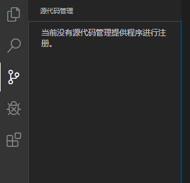

# [HelloGit](https://zhmhbest.github.io/HelloGit/)

- [Download Git](https://git-scm.com/downloads/)
- [Download SourceTree](https://www.sourcetreeapp.com/)

## 配置用户名

```bash
git config --global user.name "zhmhbest"
git config --global user.email "zhmhbest@gmail.com"
# vim ~/.gitconfig
# notepad %Userprofile%\.gitconfig
```

```
[user]
	name = zhmhbest
	email = zhmhbest@gmail.com
```

## 本地使用

### 创建本地仓库

```bash
mkdir <repositorie>
cd <repositorie>
type nul>.gitignore
git init
```

### 提交文件到仓库

```bash
# 添加文件到暂存区
git add <filename>
git add ...

# 提交删除
git rm <filename>

# 提交修改到本地仓库（创建版本记录）
git commit -m <message>
```

### 查看提交记录

```bash
# 从最近到最远的显示提交记录（包括作者和日期）
git log

# 精简显示
git log --pretty=oneline

# 指明版本走向（方便查看分支融合情况）
git log --graph --pretty=oneline
```

### 查看工作区状态

```bash
# 红色：已修改或未添加文件
# 绿色：已添加到暂存区的文件
git status
```

### 放弃文件的修改

```bash
# 放弃 暂存区修改
# git reset HEAD <filename>
git restore --staged <filename>

# 放弃 工作区修改
git checkout -- <filename>
```

### 对比文件差异

```bash
# 工作区与最近本地仓库对比
# git diff HEAD -- <filename>
git diff <filename>

# 对比最近两个本地仓库
git diff HEAD HEAD^ -- <filename>
```

### 查看版本记录（包括被删除的）

```bash
git reflog
```

### 版本回退与撤销

```bash
# 回退1个版本
git reset --hard HEAD^

# 回退2个版本
git reset --hard HEAD^^

# 回退100个版本
git reset --hard HEAD~100

# 回退到指定版本，参数由`git reflog`获取
git reset --hard <7bitcode>
```

### 工作现场

```bash
# 保存工作现场
git stash

# 列出保存的工作现场
git stash list

# 恢复工作现场
git stash pop
```

## 分支管理

### 查看分支

```bash
# 查看本地所有分支
git branch

# 查看本地所有分支（包括指纹）
git branch -v
```

### 创建分支

```bash
# 拷贝当前分支，创建新分支
git branch <branchname>

# 重命名分支
git branch –m <oldname> <newname>

# 删除分支
git branch –d <branchname>

# 强制删除分支
git branch –D <branchname>

# 切换分支
# git checkout master
git checkout <branchname>

# 拷贝当前分支，创建新分支，并切换到
git checkout -b <branchname>
```

### 合并分支

| 冲突情况 | 解决方案 |
| - | - |
| 两个分支对同一个文件做了修改 | 合并后，需要手动修改该文件再做一次提交 |
| 两个分支分别新增了各自的文件 | 合并后，Git会自动再做一次提交 |

```bash
# 快速合并（Fast-forward）指定分支到当前分支
git merge <branchname> -m <message>

# 禁用快速合并（合并后重新做一次新的提交）
git merge --no-ff <branchname> -m <message>

# 查看已合并、未合并的分支
git branch --merged
git branch --no-merged
```

## 云端联动

- [Github](https://github.com)
- [Gitee](https://gitee.com/)

### 为Github添加密钥

#### 新建钥匙

```bash
ssh-keygen -t rsa -C "zhmhbest@gmail.com"

# Generating public/private rsa key pair.
# Enter file in which to save the key (%Userprofile%/.ssh/id_rsa):
# ...
notepad %Userprofile%/.ssh/id_rsa.pub
```

#### 将公钥保存到Github

>[Settings](https://github.com/settings) > [SSH and GPG keys](https://github.com/settings/keys) > [New SSH key](https://github.com/settings/ssh/new)



#### 配置无效问题

使用https时，无法应用ssh密钥。

```bash
# 查看问题是否存在
git remote -v

# origin  https://github.com/<用户名>/<仓库名> (fetch)
# origin  https://github.com/<用户名>/<仓库名> (push)
```

```bash
# 修改连接方式
git remote rm origin
git remote add origin git@github.com:<用户名>/<仓库名>.git
git remote -v
git push -u origin master

# 第一次使用SSH推送会产生警告
# The authenticity of host 'github.com (13.229.188.59)' can't be established.
# RSA key fingerprint is SHA256:nThbg6kXUpJWGl7E1IGOCspRomTxdCARLviKw6E5SY8.
# Are you sure you want to continue connecting (yes/no/[fingerprint])? yes
```

### 从云端克隆一个仓库

```bash
git clone https://github.com/<用户名>/<远程仓库名>.git
```

### 跟踪

#### 本地仓库跟踪远程仓库

```bash
# cd <本地仓库目录>
git remote add origin https://github.com/<用户名>/<远程仓库名>.git
git push -u origin master
```

#### 本地分支跟踪云端分支

```bash
# git push origin master
git branch --set-upstream-to=origin/<远程分支名> <本地分支名>
```

### 云端互传

```bash
# 当前分支推送到远程
# git push origin master
git push origin <远程分支名>

# 当配置远程跟踪后可以直接使用如下命令
git push

# 拉取云端分支到本地并自动合并
git pull origin <远程分支名>
```

### 获取最新远程分支到本地

```bash
git fetch origin master:tmp
git diff tmp
git merge tmp
git branch –d tmp
```

### 远程分支管理

```bash
# 查看云端所有分支
git branch -r

# 查看本地和远程所有分支
git branch -a

# 删除远程分支
git branch –d -r <branchname>
git push origin:<branchname>
```

## 在集成开发环境中使用版本控制

>确定在环境变量中可以找到`git.exe`。

### [IDEA](https://www.jetbrains.com/idea/download/other.html)

- 
- 

### [VSCode](https://code.visualstudio.com/Download)

- 
- 