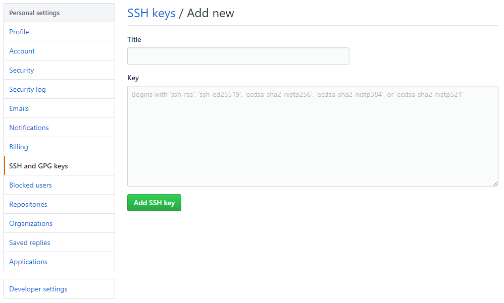

#### 配置Github密钥

>[Settings](https://github.com/settings) > [SSH and GPG keys](https://github.com/settings/keys) > [New SSH key](https://github.com/settings/ssh/new)



##### 密钥无效问题

使用https时，无法应用密钥。

```bash
# 查看问题是否存在
git remote -v

# origin  https://github.com/<用户名>/<仓库名> (fetch)
# origin  https://github.com/<用户名>/<仓库名> (push)
```

```bash
# 修改连接方式
git remote rm origin
git remote add origin git@github.com:<用户名>/<仓库名>.git
git remote -v
git push -u origin master

# 第一次使用SSH推送会产生警告
# The authenticity of host 'github.com (13.229.188.59)' can't be established.
# RSA key fingerprint is SHA256:nThbg6kXUpJWGl7E1IGOCspRomTxdCARLviKw6E5SY8.
# Are you sure you want to continue connecting (yes/no/[fingerprint])? yes
```

#### 从云端克隆一个仓库

```bash
# https
git clone https://github.com/<用户名>/<远程仓库名>.git

# ssh
git clone git@github.com:<用户名>/<远程仓库名>.git
```

#### 关联云端

```bash
# 本地仓库关联远程仓库
git remote add origin https://github.com/<用户名>/<远程仓库名>.git

# 查看远程仓库地址
git remote -v

# 解除与远程仓库的关联
git remote rm origin

# 本地分支关联云端分支
git branch --set-upstream-to=origin/<远程分支名> <本地分支名>
```

#### 分支推送

```bash
# 指定分支推送到远程分支（远程分支不存在会自动创建）
git push origin <本地分支名>:<远程分支名>

# 当前分支推送到远程分支（远程分支不存在会自动创建）
git push origin <远程分支名>

# 设定默认远程主机，并推送当前分支到master（以后可省略origin）
git push -u origin master

# 当配置默认主机与远程分支关联后，可直接使用如下命令
git push
```

#### 分支拉取

`git pull = git fetch + git merge`

```bash
# 拉取云端分支到本地并创建新的本地分支
git fetch origin <远程分支名>:<本地分支名>

# 设置执行pull操作时的合并方法
git config pull.rebase false  # merge (the default strategy)
git config pull.rebase true   # rebase
git config pull.ff only       # fast-forward only

# 拉取云端分支到当前分支，并自动合并
git pull origin <远程分支名>
```

##### 安全拉取

```bash
# Step1.获取远程master分支到本地创建为tmp
git fetch origin master:tmp

# Step2.查看当前分支与刚获取的远程分支差异
git diff tmp

# Step3.将最新远程分支合并入当前分支
git merge tmp

# Step4.删除创建的临时分支
git branch –d tmp
```

#### 拉取文件夹

只拉取一个仓库的部分文件夹。

```bash
remote_origin="https://github.com/cdarlint/winutils"
dir_path="hadoop-3.2.1/bin"

mkdir dump/
pushd dump/
git init
git remote add -f origin "$remote_origin"
#允许使用Sparse Checkout模式
git config core.sparsecheckout true
echo "$dir_path">>.git/info/sparse-checkout
git pull origin master
# popd
# rm -f dump/
```

#### 远程分支管理

```bash
# 查看云端所有分支
git branch -r

# 查看本地和远程所有分支
git branch -a

# 删除远程分支（以下均可）
git branch –d -r <远程分支名>
git push origin :<远程分支名>
git push origin --delete <远程分支名>
```
